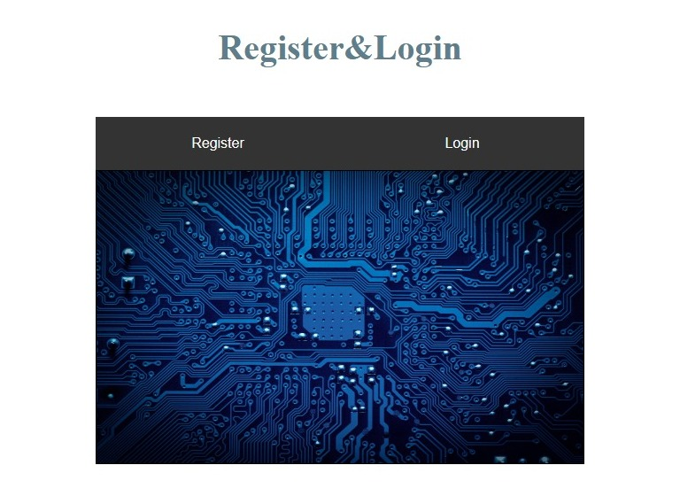
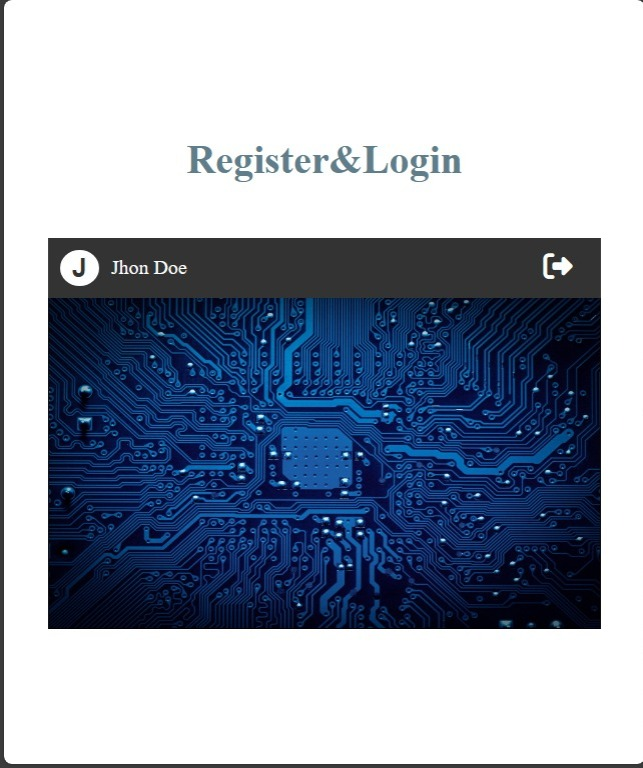

# Register & Login v2🚀

## Description 📝:
- This form submits the data and registers it in a MongoDB database.
- This project is an enhancement to the first login project.
- Although you can see it is static, it is connected and logs the data to a noSQL database (MongoDB).
- Due to lack of knowledge and experience, it was not possible to display the data in another path of the page.
- Here you will be able to see a static version of the project, of course without the online server (for now).
- URL: https://juanrcoder.github.io/Project-Login_Register_v2/
## Performance Pictures 📝:

## Languajes / Tools📌:
- HTML
- CSS
- JavaScript - jQuery
- Node.js (Express, mongoose)
- MongoDB
- VSCode

## Author:
- Juan Ramirez 😃
